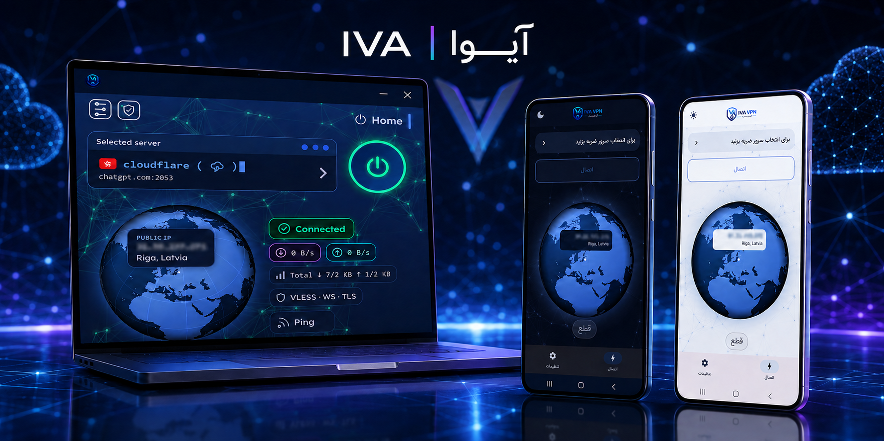
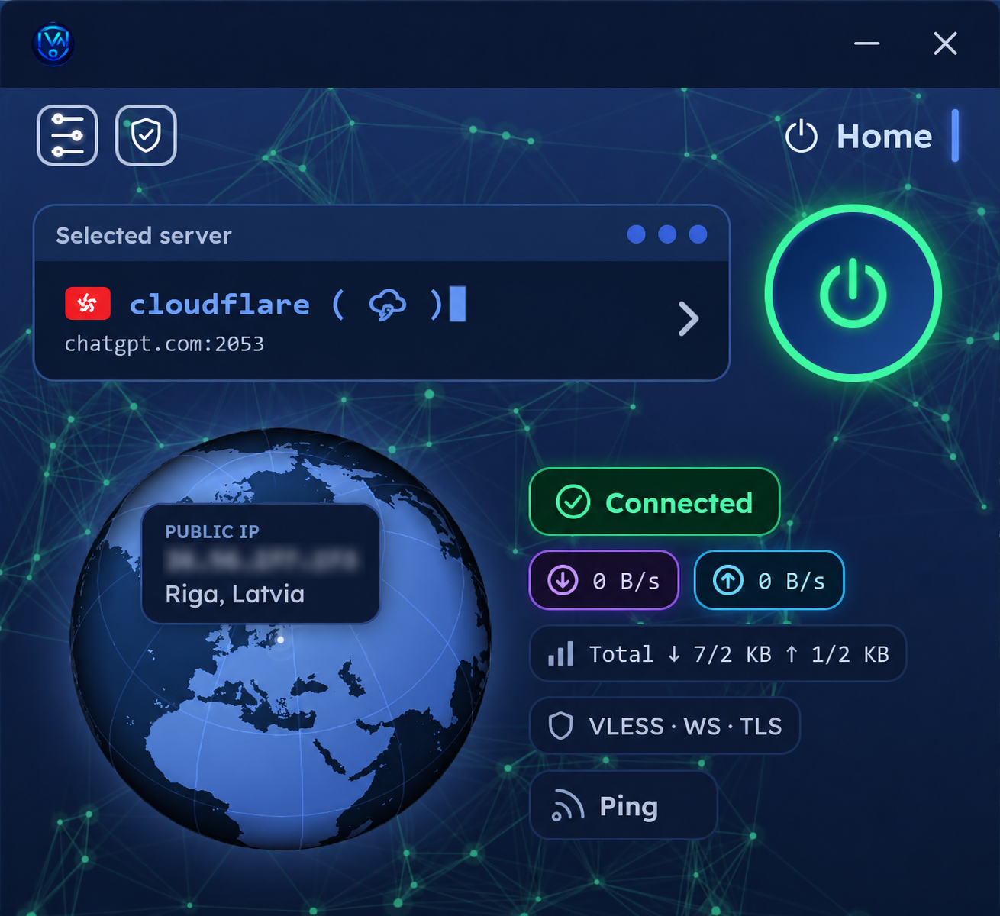
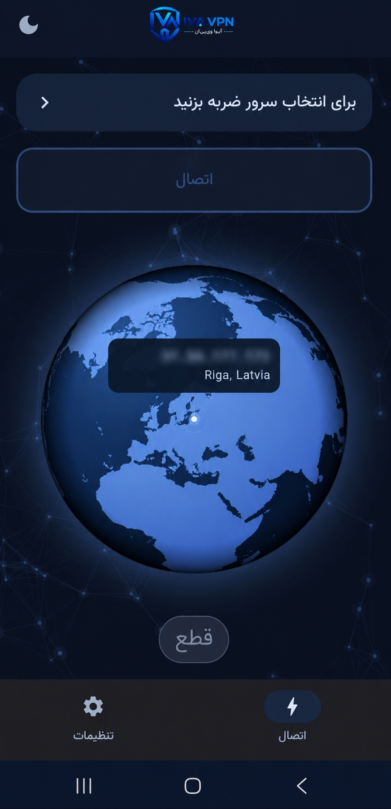
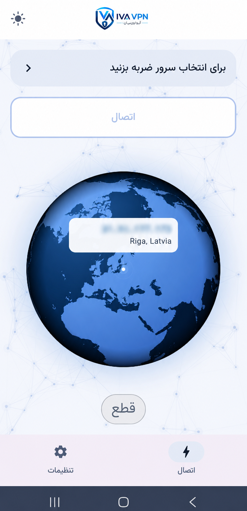

  

  <a href="README.md">فارسی</a> ·
  <a href="README.en.md">English</a> ·
  <a href="README.ru.md">Русский</a>

  
  
  
  
  
  
  
  

  <a href="https://install.ivaworks.site/"><strong>One-click install</strong></a> ·
  <a href="../../releases"><strong>Download apps</strong></a> ·
  <a href="docs/FEATURE_MATRIX.md"><strong>All features</strong></a> ·
  <a href="docs/en/FAQ.md"><strong>FAQ</strong></a> ·
  <a href="https://net.ivaworks.site/"><strong>Network radar</strong></a> ·
  <a href="https://t.me/Ivaworkersup"><strong>Support</strong></a> ·
  <a href="docs/en/GITHUB_PAGES.md"><strong>Publish website</strong></a>

# IVA Panel

The official documentation, downloads, and release hub for **IVA Panel** — a professional multi-location management panel powered by Cloudflare Workers.

> This is the official distribution and documentation repository. IVA Panel's proprietary source code is not published here.

## Why IVA Panel?

| Capability | What it provides |
|---|---|
| ☁️ Cloudflare Workers architecture | The panel itself runs without a separate VPS |
| 🌍 Multi-Location | Multiple locations and infrastructure endpoints in one dashboard |
| ⚡ One-click installation | Official web and Telegram installation paths |
| 💾 Backup & Restore | Full backup, recovery, and migration workflow |
| 🤖 Telegram management | Official automation for installation and management operations |
| 🖥 Dedicated applications | Android 10+ and Windows x64 |
| 📡 Network Intelligence | Live status, latency, and disruption radar |
| 🌐 Trilingual documentation | Persian, English, and Russian maintained in this repository |

## Current stable versions

| IVA Worker | Panel | Installer | Channel | Released UTC | Minimum version |
|:---:|:---:|:---:|:---:|:---:|:---:|
| `4.4.73` | `10.7.59` | `1.4.9` | `stable` | `2026-08-17 19:55` | `4.4.55` |

This update is not mandatory. See the official **[Feature Matrix](docs/FEATURE_MATRIX.md)** for the complete v1/v2/v3 comparison of more than one hundred capabilities, including National Internet, Arvan CDN, and Google Apps Script Relay in v3.

## Quick installation

1. Create a Cloudflare account with an email address you can access and verify.
2. Create a **restricted, short-lived API Token** in Cloudflare; never use the Global API Key.
3. Open the [official web installer](https://install.ivaworks.site/) or [@IVAPANELBOT](https://t.me/IVAPANELBOT).
4. Submit the token only through one of these official paths and choose the panel creation option.
5. Store the returned panel address and password securely.
6. Revoke or rotate the Cloudflare token after installation.

See the [complete English installation guide](docs/en/INSTALLATION.md).

> **Security warning:** Never post a Cloudflare token, panel password, or private configuration in an Issue, public group, or channel. Grant only the minimum permissions required.

## Applications

Official binaries are published on [GitHub Releases](../../releases), not committed to the repository history.

| Platform | Suggested asset | Best for |
|---|---|---|
| Android 10 or later | `app-universal-release.apk` | Universal build for common architectures |
| Windows 64-bit | `IVA-VPN-1.0.1-Setup.exe` | x64 systems only; no 32-bit build |

[Android guide](apps/android/README.md) · [Windows guide](apps/windows/README.md)

  

## Real application screenshots

### Windows 64-bit

  

### Android 10+ — dark and light themes

  
  

## IVA Network Intelligence

The live IVA internet radar provides real-time service status, direct tests from Iran and worldwide, network traffic and latency, outage detection, and intelligent network analysis.

**[Open the radar](https://net.ivaworks.site/)**

  

## Local trilingual FAQ

The complete FAQ now lives in this repository and covers installation, security, Multi-Location, Backup/Restore, applications, Relays, Requests, limits, and support.

**[Open the English FAQ](docs/en/FAQ.md)** · [فارسی](docs/fa/FAQ.md) · [Русский](docs/ru/FAQ.md)

  

## Official links

| Resource | Address |
|---|---|
| Official website | [ivaworks.site](https://ivaworks.site/) |
| Web installer | [install.ivaworks.site](https://install.ivaworks.site/) |
| Announcement channel | [@PANEL_ivaworks](https://t.me/PANEL_ivaworks) |
| Panel installation bot | [@IVAPANELBOT](https://t.me/IVAPANELBOT) |
| IVA Mailer bot | [@IVAmailbot](https://t.me/IVAmailbot) |
| Support | [@Ivaworkersup](https://t.me/Ivaworkersup) |
| User group | [@IVA_Panel_group](https://t.me/IVA_Panel_group) |
| FAQ | [English FAQ in this repository](docs/en/FAQ.md) |
| Internet radar | [net.ivaworks.site](https://net.ivaworks.site/) |

## Support and issue reporting

- Read the [English FAQ](docs/en/FAQ.md) first.
- Use the GitHub **Bug report** template for app defects; never attach secrets or account data.
- Contact [@Ivaworkersup](https://t.me/Ivaworkersup) for installation or account help.
- Do not disclose security vulnerabilities publicly; follow [SECURITY.md](SECURITY.md).

## Repository maintainer guide

If you publish the project, follow the [beginner GitHub setup and release guide](docs/en/GITHUB_SETUP.md) and the [GitHub Pages publishing guide](docs/en/GITHUB_PAGES.md). The trilingual project website is stored at `docs/index.html` and is published by selecting `main /docs` in Pages settings. The folder inventory is in [docs/README.md](docs/README.md). Complete and review [the privacy policy template](docs/PRIVACY_POLICY_TEMPLATE.md) using verified data practices before any public launch.

## License and ownership

This project is **not open source**. All rights in the proprietary code, binaries, name, logo, and original content are reserved by IVA Team. Downloading or using a release does not grant permission to copy, redistribute, sell, reverse engineer, or create derivative works. See [LICENSE.md](LICENSE.md).

Cloudflare and related names and marks belong to their respective owners. IVA Works is not affiliated with or endorsed by Cloudflare.

© 2026 IVA Team — All Rights Reserved.
