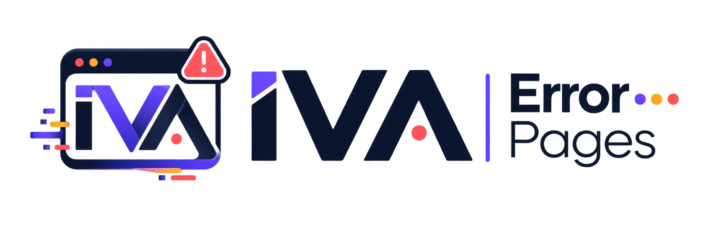
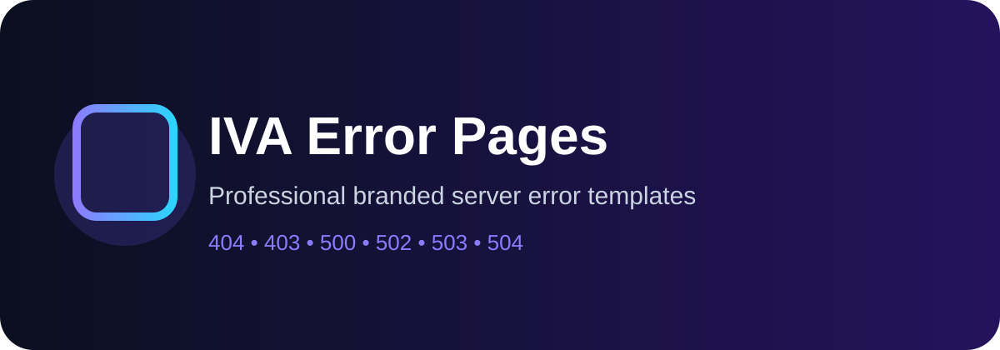

<p align="center">

</p>

# IVA Error Pages

Modern customizable error pages by **IVA Works**.

🌐 https://ivaworks.site  
📧 info@ivaworks.site



<p align="center">

</p>

<p align="center">
<b>Professional branded error page kit for cPanel, DirectAdmin and custom servers.</b>
</p>

<p align="center">


</p>

# IVA Error Page Kit

مجموعه‌ای حرفه‌ای و برندشده از صفحات خطا (Error Pages) برای هاست‌های مبتنی بر **cPanel** و **DirectAdmin**، با هویت بصری برند **IVA**.

پیش‌نمایش زنده: فایل `index.html` را در مرورگر باز کنید یا با GitHub Pages منتشر کنید.

## صفحات موجود

| کد | عنوان | فایل |
|----|-------|------|
| 400 | Bad Request | `pages/400.html` |
| 401 | Unauthorized | `pages/401.html` |
| 403 | Forbidden | `pages/403.html` |
| 404 | Not Found | `pages/404.html` |
| 500 | Internal Server Error | `pages/500.html` |
| 502 | Bad Gateway | `pages/502.html` |
| 503 | Service Unavailable | `pages/503.html` |
| 504 | Gateway Timeout | `pages/504.html` |

## ساختار پروژه

```
iva-error-pages/
├── index.html              # گالری/پیش‌نمایش همه صفحات
├── pages/                  # صفحات خطا (400 تا 504)
├── assets/
│   ├── css/iva-error.css   # سیستم طراحی و توکن‌های برند
│   ├── js/iva-error.js     # زمان و شناسه‌ی درخواست
│   └── img/iva-mark.svg    # لوگوی برند
├── LICENSE
└── README.md
```

هر صفحه کاملاً مستقل، بدون وابستگی به فریم‌ورک، ریسپانسیو و سازگار با `prefers-reduced-motion` است.

## نصب روی cPanel

1. وارد بخش **File Manager** در cPanel شوید.
2. پوشه‌ی `assets` و فایل‌های داخل `pages` را داخل `public_html` (یا مسیر دامنه‌ی موردنظر) آپلود کنید.
3. از منوی cPanel به بخش **Error Pages** بروید.
4. برای هر کد خطا (403، 404، 500 و ...) گزینه‌ی ویرایش را بزنید و محتوای فایل متناظر در `pages/` را جایگزین کنید،
   یا در تنظیمات وب‌سرور (Apache/`.htaccess`) مسیر را مستقیم مشخص کنید:

```apache
ErrorDocument 404 /pages/404.html
ErrorDocument 403 /pages/403.html
ErrorDocument 500 /pages/500.html
ErrorDocument 502 /pages/502.html
ErrorDocument 503 /pages/503.html
ErrorDocument 504 /pages/504.html
```

## نصب روی DirectAdmin

1. فایل‌ها را از طریق **File Manager** یا FTP در دایرکتوری `domains/yourdomain.com/public_html` قرار دهید.
2. از بخش **Advanced Features → Error Pages** صفحه‌ی موردنظر را انتخاب و مسیر فایل جدید را ثبت کنید،
   یا مشابه بالا از `ErrorDocument` در `.htaccess` استفاده کنید.

## سفارشی‌سازی برند

تمام رنگ‌ها، فونت‌ها و شعاع گوشه‌ها به‌صورت متغیرهای CSS در ابتدای فایل
`assets/css/iva-error.css` تعریف شده‌اند:

```css
:root {
  --iva-violet: #6e5bff;   /* رنگ اصلی برند */
  --iva-amber:  #f5a623;   /* هشدارهای ۴xx */
  --iva-red:    #ff5468;   /* خطاهای بحرانی ۵xx */
  --font-display: 'Space Grotesk', sans-serif;
  --font-body: 'Inter', sans-serif;
}
```

آدرس ایمیل پشتیبانی (`support@iva.example`) و لینک بازگشت به صفحه‌ی اصلی
در هر فایل HTML، داخل بخش `.iva-actions`، قابل ویرایش است.

## لایسنس

MIT — به‌صورت آزاد قابل استفاده و ویرایش در پروژه‌های شخصی و تجاری.

## 🚀 Live Demo

Try IVA Error Pages online:

https://ivaworks.site

Demo pages are available in the `demo/` directory and can be deployed with GitHub Pages.
