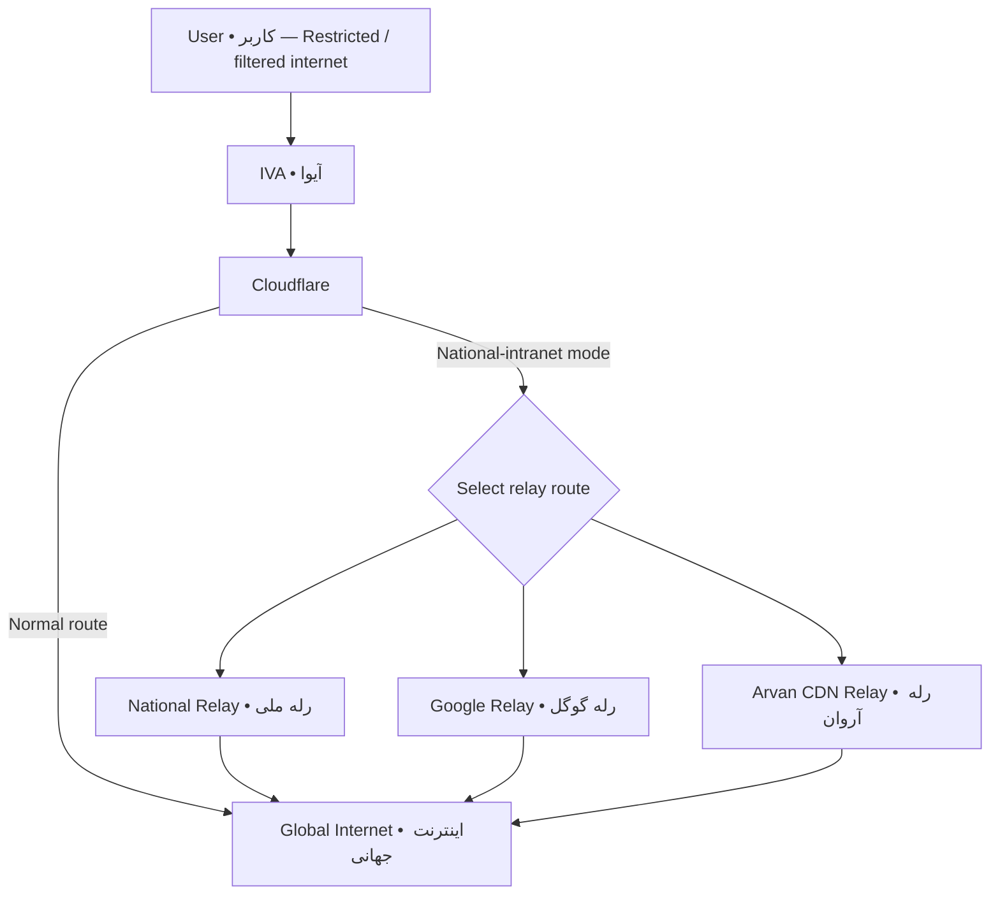
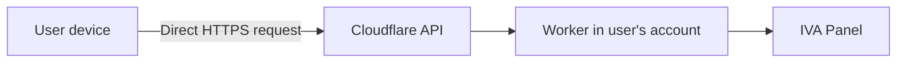

# Architecture and data flow

This page documents the current public privacy architecture of IVA Panel in Persian, English, and Russian.

## فارسی

### مسیر نصب

1. کاربر نصب‌کنندهٔ رسمی وب یا رابط رسمی ربات را روی دستگاه خود باز می‌کند.
2. درخواست Cloudflare مستقیماً از دستگاه کاربر به API رسمی Cloudflare ارسال می‌شود.
3. توکن از سرور IVA، ربات Telegram یا پیام‌های Telegram عبور نمی‌کند.
4. پنل در حساب Cloudflare متعلق به خود کاربر ایجاد می‌شود.
5. آدرس پنل و رمز در اختیار کاربر قرار می‌گیرد و باید در محل امن نگهداری شود.

### چیزهایی که IVA ذخیره نمی‌کند

- Cloudflare API Token یا Global API Key
- ایمیل و اطلاعات حساب Cloudflare
- آدرس IP کاربر
- رمز پنل یا تنظیمات خصوصی
- تاریخچهٔ نصب و لاگ فعالیت
- آمار تحلیلی، Cookie رهگیری یا پروفایل تبلیغاتی

سایت `docs.ivaworks.site` ایستا است، بک‌اند کاربردی ندارد و به پایگاه داده متصل نیست.

## English

The official installer sends Cloudflare requests directly from the user's device to the Cloudflare API. Tokens are not relayed through an IVA server, Telegram bot, or Telegram message. IVA does not store account data, IP addresses, panel passwords, installation history, analytics, tracking cookies, or activity logs. The documentation website is static and has no application backend or database.

## Русский

Официальный установщик отправляет запросы напрямую с устройства пользователя в API Cloudflare. Токены не проходят через сервер IVA, Telegram-бота или сообщения Telegram. IVA не хранит данные аккаунта, IP-адреса, пароли панели, историю установки, аналитику, отслеживающие Cookie или журналы активности. Сайт документации статический и не имеет серверной части или базы данных.

## Security boundary

Cloudflare independently processes requests under its own terms and privacy policy. Users should create a restricted, short-lived token, never publish it, and revoke or rotate it after installation.

## Connection routing

The normal connection path is **User → IVA → Cloudflare → Global Internet**. If national-intranet mode is active, IVA can use an additional route after Cloudflare through a National Relay, Google Relay, or Arvan CDN Relay. The available route depends on the active panel configuration and current network availability.

The relay nodes above are alternative routes; normal traffic does not pass through all three relays in sequence.

## Installation data flow

See also: [[Release Information]] · [[FA-Privacy-and-Terms]] · [[EN-Privacy-and-Terms]] · [[RU-Privacy-and-Terms]].
