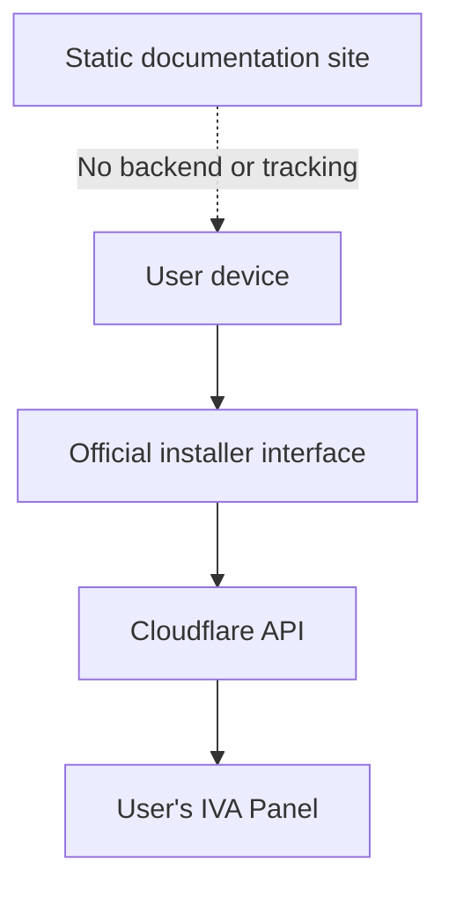

  

  <strong>IVA Panel · آیوا پنل · Панель IVA</strong> 
  Professional multi-location management powered by Cloudflare Workers

  
  
  
  
  
  

## Choose your language · زبان را انتخاب کنید · Выберите язык

| فارسی | English | Русский |
|---|---|---|
| [[شروع از اینجا|FA-Overview]] | [[Start here|EN-Overview]] | [[Начать здесь|RU-Overview]] |
| [[نصب کامل|FA-Installation]] | [[Installation|EN-Installation]] | [[Установка|RU-Installation]] |
| [[سؤالات متداول|FA-FAQ]] | [[FAQ|EN-FAQ]] | [[FAQ|RU-FAQ]] |
| [[امنیت و پشتیبانی|FA-Security-and-Support]] | [[Security and support|EN-Security-and-Support]] | [[Безопасность и поддержка|RU-Security-and-Support]] |

## Official resources

| Resource | Official address |
|---|---|
| Documentation | https://docs.ivaworks.site/ |
| Web installer | https://install.ivaworks.site/ |
| GitHub repository | https://github.com/MR-SHARIFI-Dev/IVA-PANEL |
| Network Intelligence | https://net.ivaworks.site/ |
| Telegram channel | https://t.me/PANEL_ivaworks |
| Installation bot | https://t.me/IVAPANELBOT |
| Support | https://t.me/Ivaworkersup |
| Community group | https://t.me/IVA_Panel_group |
| Official email | info@ivaworks.site |

## Architecture at a glance

Installation and Cloudflare API requests are sent directly from the user's device to Cloudflare. IVA does not store the Cloudflare token, account data, user IP address, or activity logs. The documentation website is static and has no application backend.

Read the full explanation in [[Architecture and data flow]].

> IVA Panel is proprietary software owned by **IVA Team**. This public repository and Wiki provide official documentation and release information; they do not publish the proprietary source code.

